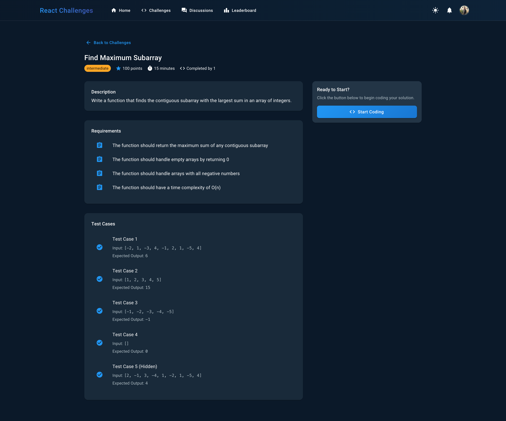
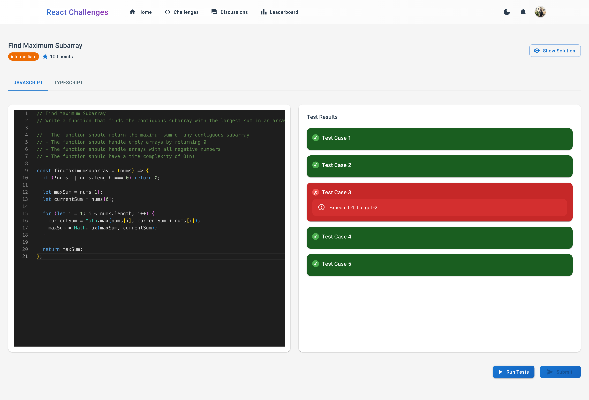
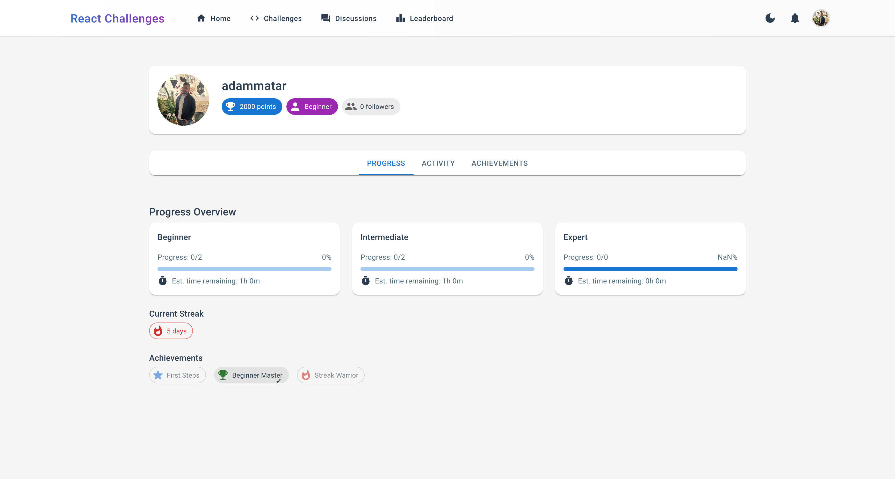

[](https://github.com/yourusername/react-challenges/actions/workflows/ci.yml)
[](https://www.typescriptlang.org/)
[](https://reactjs.org/)
[](https://opensource.org/licenses/MIT)
[](https://github.com/prettier/prettier)

# React Challenges Platform

A modern, interactive coding platform built with React and TypeScript, designed to help developers improve their programming skills through hands-on challenges.

## 📸 Screenshots

### Challenge List View
<div style="display: flex; gap: 20px; margin-bottom: 20px;">
  <div>
    
    <p style="text-align: center;">Light Mode</p>
  </div>
  <div>
    
    <p style="text-align: center;">Dark Mode</p>
  </div>
</div>

### Challenge Details
<div style="display: flex; gap: 20px; margin-bottom: 20px;">
  <div>
    
    <p style="text-align: center;">Light Mode</p>
  </div>
  <div>
    
    <p style="text-align: center;">Dark Mode</p>
  </div>
</div>

### Code Editor
<div style="display: flex; gap: 20px; margin-bottom: 20px;">
  <div>
    
    <p style="text-align: center;">Light Mode</p>
  </div>
  <div>
    
    <p style="text-align: center;">Dark Mode</p>
  </div>
</div>

### Test Results
<div style="display: flex; gap: 20px; margin-bottom: 20px;">
  <div>
    
    <p style="text-align: center;">Light Mode</p>
  </div>
  <div>
    
    <p style="text-align: center;">Dark Mode</p>
  </div>
</div>

### Admin Dashboard
<div style="display: flex; gap: 20px; margin-bottom: 20px;">
  <div>
    
    <p style="text-align: center;">Light Mode</p>
  </div>
  <div>
    
    <p style="text-align: center;">Dark Mode</p>
  </div>
</div>

### User Profile
<div style="display: flex; gap: 20px; margin-bottom: 20px;">
  <div>
    
    <p style="text-align: center;">Light Mode</p>
  </div>
  <div>
    
    <p style="text-align: center;">Dark Mode</p>
  </div>
</div>

## 🌟 Key Features

- **Interactive Code Editor**
  - Real-time code execution
  - Support for JavaScript and TypeScript
  - Syntax highlighting and intelligent code completion
  - Error detection and debugging tools

- **Challenge System**
  - Multiple difficulty levels (Beginner, Intermediate, Expert)
  - Real-time test execution and feedback
  - Comprehensive test cases with detailed explanations
  - Progress tracking and performance metrics

- **User Experience**
  - Clean, modern Material-UI design
  - Responsive layout for all devices
  - Dark/Light theme support
  - Intuitive navigation and workflow

- **Admin Dashboard**
  - Challenge management system
  - User analytics and insights
  - Performance monitoring
  - Content moderation tools

## 🚀 Live Demo

Coming Soon

## 🛠️ Technology Stack

### Frontend
- React 18 with TypeScript
- Material-UI (MUI) for UI components
- Monaco Editor for code editing
- React Router v6 for navigation
- Context API for state management

### Backend & Infrastructure
- Firebase Authentication
- Cloud Firestore for data storage
- Firebase Hosting
- Firebase Security Rules

### Development Tools
- Vite for fast development and building
- ESLint for code quality
- Prettier for code formatting
- TypeScript for type safety
- Jest for testing

## 📋 Prerequisites

- Node.js (v14 or higher)
- npm or yarn
- Firebase account
- Git

## 🔧 Installation

1. Clone the repository:
   ```bash
   git clone https://github.com/yourusername/react-challenges.git
   cd react-challenges
   ```

2. Install dependencies:
   ```bash
   npm install
   ```

3. Set up environment variables:
   ```bash
   cp .env.example .env
   ```
   Fill in your Firebase configuration details in the .env file.

4. Start the development server:
   ```bash
   npm run dev
   ```

## 📁 Project Structure

```
react-challenges/
├── src/
│   ├── components/      # Reusable UI components
│   ├── contexts/        # React contexts
│   ├── hooks/          # Custom React hooks
│   ├── pages/          # Page components
│   ├── services/       # API and service functions
│   ├── types/          # TypeScript definitions
│   └── utils/          # Utility functions
├── public/             # Static assets
└── tests/              # Test files
```

## 🧪 Testing

Run the test suite:
```bash
npm test
```

Run tests with coverage:
```bash
npm run test:coverage
```

## 🚀 Deployment

1. Build the project:
   ```bash
   npm run build
   ```

2. Deploy to Firebase:
   ```bash
   npm run deploy
   ```

## 🤝 Contributing

1. Fork the repository
2. Create your feature branch
3. Commit your changes
4. Push to the branch
5. Create a Pull Request

Please read [CONTRIBUTING.md](CONTRIBUTING.md) for details on our code of conduct and the process for submitting pull requests.

## 📈 Future Improvements

- [ ] Add more challenge categories
- [ ] Implement real-time collaboration
- [ ] Add code sharing functionality
- [ ] Integrate with GitHub for authentication
- [ ] Add more programming languages support
- [ ] Implement a mentorship system

## 📄 License

This project is licensed under the MIT License - see the [LICENSE](LICENSE) file for details.

## 👏 Acknowledgments

- [Monaco Editor](https://microsoft.github.io/monaco-editor/)
- [Material-UI](https://mui.com/)
- [Firebase](https://firebase.google.com/)
- All contributors who have helped this project grow

## 📞 Contact

Adam Matar - [mataradam@gmail.com](mailto:mataradam@gmail.com)

[](https://linkedin.com/in/adammatar)

Project Link: [https://github.com/adammatar/react-challenges](https://github.com/adammatar/react-challenges)
